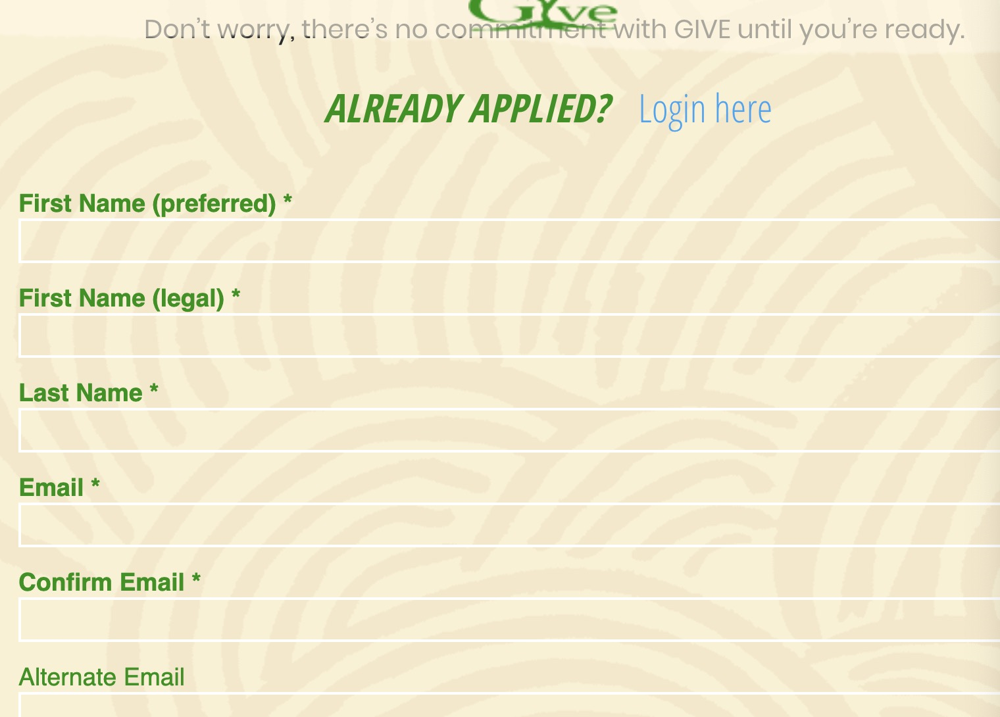
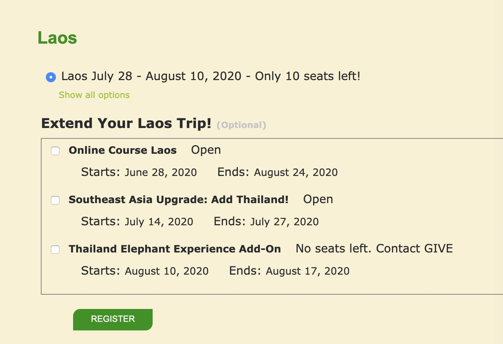
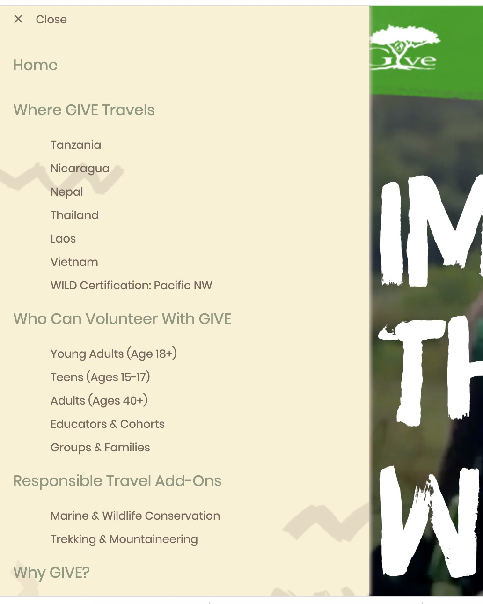
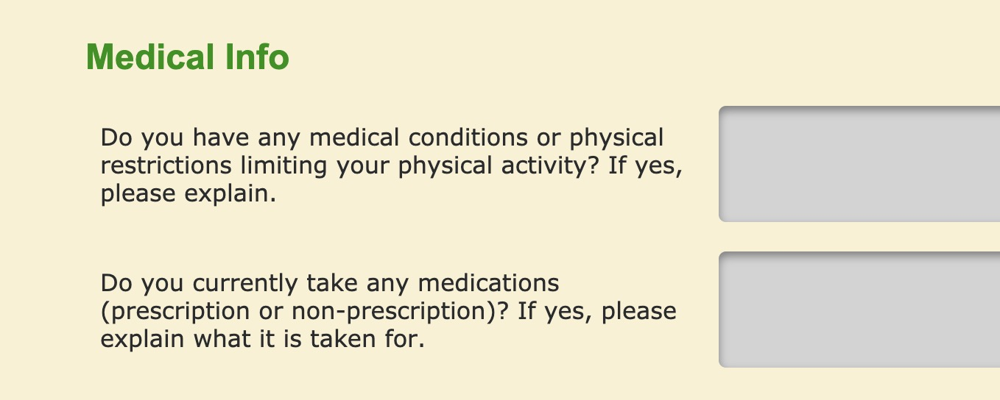
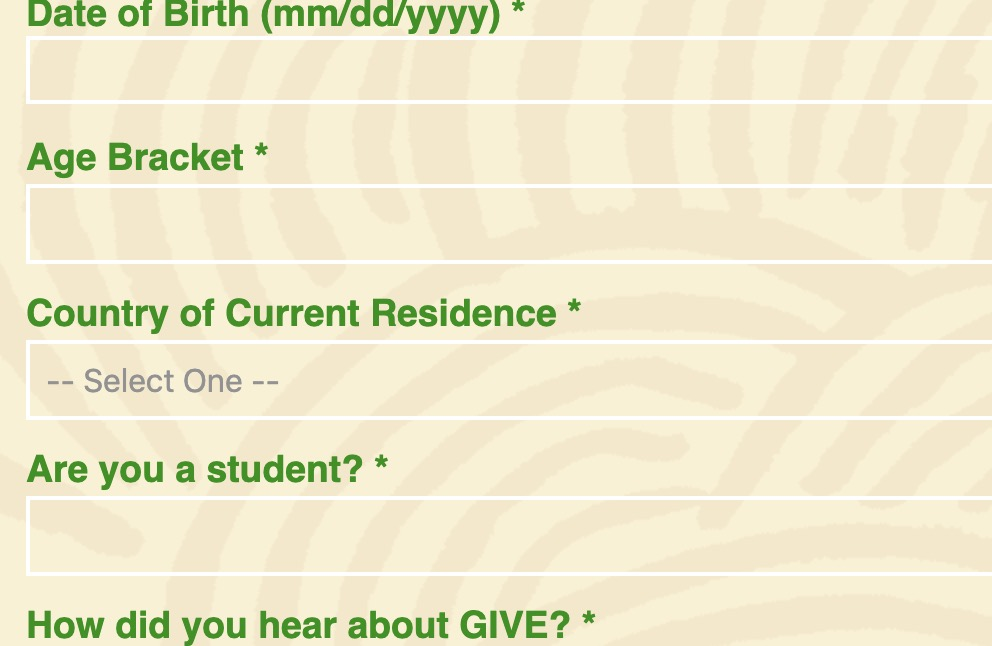
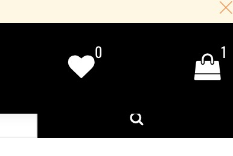
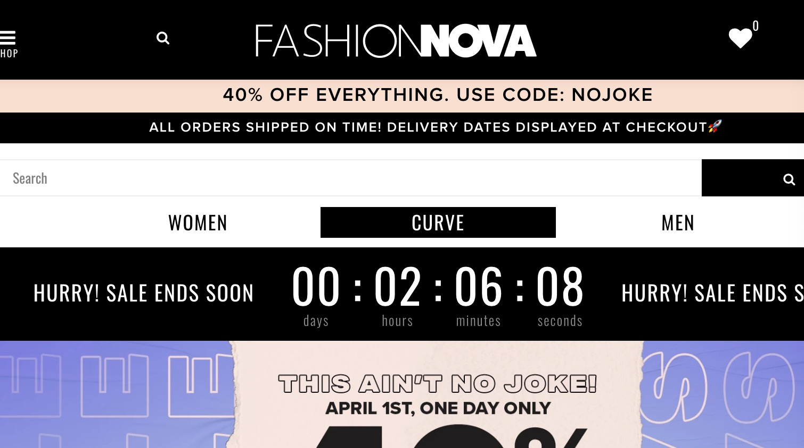
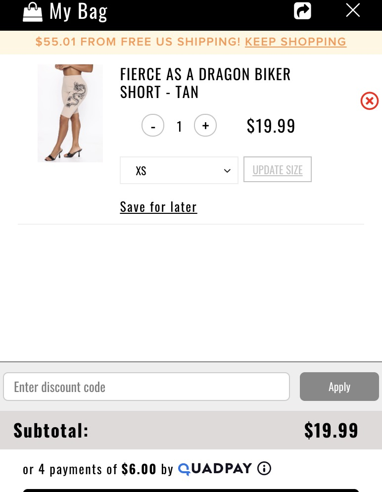
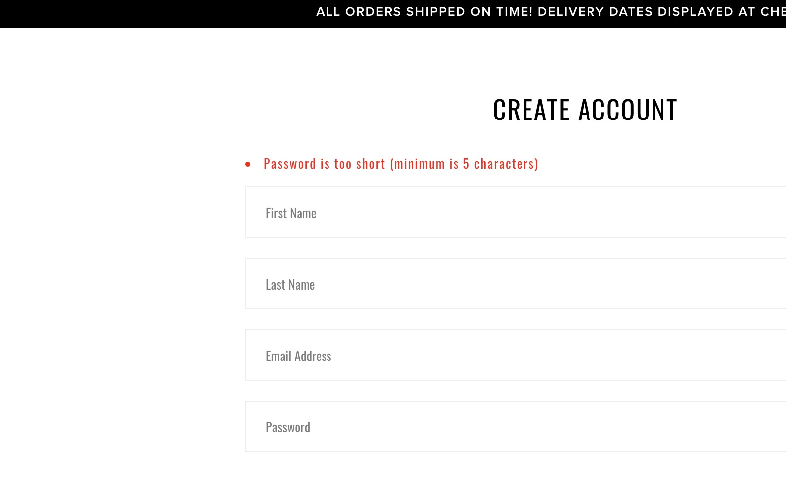

# GIVE LOVE OUT
My name is Bingcui (Violet) Guo.  And this is DH150 User Experience Design in Spring 2020, from which I learned how to design a good user interface to bring users good experience. 

In this project, I will propose a novel ux design of a website to enhance the aesthetic experience for an international volunteer organization. By enhancing the design of its website, I hope this could make this website more formalized and organized and thus make it clear for more applicants who want to contribute to the world to understand what programs  the organization offers and how they could become an international volunteer. By doing this will also enhance the efficiency and satisfaction when uses browse this website to retrieve the information they want. 

I have 2 websites to analyze. The first one is GIVE Volunteer, which is the potential choice of my final project. The below is the screen shot of the organization’s homepage. And its URL is <a href="https://www.givevolunteers.org/" target="_blank">GIVE</a> . It is a website to display what GIVE does, the programs that GIVE organization provides, their belief, application, and some logistics and preparation to be an international volunteer. 

Why I want to improve this website was that in my Grade Ten in high school, I have several organizations in mind and GIVE is one of them. But  because the website was very confusing to me at that time(because I am an international student and my English was not that good and I am not fully adapted to American websites) so I chose some other organizations with better UX showing. However, after coming to college, I joined the volunteer club at UCLA and there were people who participated in GIVE’s program and said it might be one of the most organized and best experiences compared to other organizations. I felt that they are a good organization but due to the bad homepage and navigation design, they might discourage some potential volunteers from sharing their love by being an internationl volunteer. That’s my reason of helping to redesign this website. 

My overall evaluation of this website is that although it includes all the pieces that people need to understand, the content of the program and the application process are hard to understand as well as the process after being selected. Also, it has some other unorganized navigation and repeated information filling out section, which makes me very confused. 

## Heuristic Evaluation:
### 1.Visibility of system Status
I would say this website doesn’t have any visibility of system status. For the apply page, we could see that there is not a bar showing how much the user has completed for the application form. And even after I submitted the application form and have an account to choose the programs I like, there is not a bar showing at what stage I am at (like selecting program, submitting fee, waiting for being contacted, etc.) which makes user feel confused. Also, in the WHERE GIVE TRAVELS section, it is better for it to show the number of program directly so the users could know clearly that how many choices they have at each site, which is more visual. And the severity of the problem is 3. 

### 2.Match between system and the real world
This website uses all plain text to explain what each section means so it does a relatively good job at this heuristic. 

### 3.User control and freedom
The website doesn’t give the users enough room to have their own control. For example, when I choose to register the trip, after I register, I would not be able to cancel my registration and when I select a date, there will only be something like “extend your date” which looks like an advertisement and makes me unsatisfied but I could not close it. And the more date it shows would distract me from double-checking the real date I want to choose. And the severity of this problem is 3.  

### 4.Consistency and standards
The picture and the program name and site match and all subpage of GIVE use the same style so it obeys consistency and standards. 

### 5.Error prevention
The website does have some error prevention when user type in date of birth and requires the use to type in certain format and if I type in the wrong format it won’t let me to pass. 

### 6.Recognition rather than recall
The website does so bad at this point. Because when I browse the website, I might have several programs in mind and I want to select them to narrow down my choice first and then keep browsing. However, this website doesn’t contain anything like a program selection storing bag or something to keep what I chose previously and the only thing I could do is to register for my top-choice program but if I need to cancel I need to contact them, etc. So this is a really serious problem of a severity rating of 3. 

### 7.Flexibility and efficieny of use
The website does have a menu for us to search but it is a long list and there is nothing like keyword search, which is a little bit unsatisfactory. So the severity of problem is 1. 

### 8.Aesthetic and minimalist design
The website is clear but it doesn’t have enough graphical things to help users understand. Although the layout of the website is okayish. So the severity of the problem is 1. 

### 9.Help users recognize, diagnose, and recover from errors
The page doesn’t have many help to help users recognize problem. For example, in the application form,  like Are you a student, and we might type “y”, “yes”,”YES”,“I am a student” etc. and this will increase the difficulty of recognizing what is the user input for backend data storing. But it doesn’t provide use a valid input format. When typing in some explanation of our application, the website doesn’t show the character limit while if we type in too much, it would cause difficulty for backend. This has a severity rating of 2. 

### 10.	Help and documentation 
The website doesn’t have a help of documentation section. Although the “how it works” section roughly explains how the application process would go through, there aren’t many Q&A session which address some general concerns like how I would be contacted by the local coordinator, etc. And for these questions, we might leave a note at the contact us section but it requires extra typing, which is really inconvenient. So the severity of this problem is 3. 

# ----------------------------------------------------------------------------------------------------------------------------

The other website that I want to analyze is Fashion Nova, which is an online shopping website. The screenshot is as below and its URL is <a href="https://www.fashionnova.com/" target="_blank">FASHIONNOVA</a>. It is a website for people to buy clothes of what they want. 

Why I want to improve this website is as a girl, I really like fashion and would like to buy clothes. FashionNova provides good-looking and affordable clothes but the UX of its page is not good enough so I wanna improve it. 

My overall evaluation of this website is that although it includes all the pieces that people need to understand, the navigation bar, etc. the whole page look so full and sometimes it would create confusion for users. 

## Heuristic Evaluation:
### 1.Visibility of system Status
I would say this website has done a visibility of the system like it has a bag and a heart with numbers showing that how many clothes we have collected or put into our shopping cart, which is good. 

### 2.Match between system and the real world
This website uses a section of “curve” which is really confusing for me at the beginning. And even when I click it, it shows nothing besides the section of Woman and I still don’t know what it is. Curve usually means the shape or something. The severity of the problem is 3.

### 3.User control and freedom
The website enables users to delete things from cart and gives us the flexibility to discard the clothese that we don’t wanna choose. 

### 4.Consistency and standards
The picture and the categories match and all the subpages use the same style so it obeys consistency and standards. 

### 5.Error prevention
The website does have some error prevention like when I register and my password is too short, it won’t let me create an account. 

### 6.Recognition rather than recall
The website doesn’t have a thing to remember our clothes preference or size so we need to manually reselect every time or the website would pop up some clothes that are not our style. The severity of the problem is 2. 

### 7.Flexibility and efficieny of use
The website does have a menu for us to search but it is a long list which lacks some sorting and  is a little bit unsatisfactory. So the severity of problem is 1. 

### 8.Aesthetic and minimalist design
The website is clear but it doesn’t have enough graphical things to help users understand.Also, the webpage is too full and too fancy. Severity of this problem is 1. 

### 9.Help users recognize, diagnose, and recover from errors
The website doesn’t help users to prevent errors. For example,  when I create the account, it doesn’t specify the length and what I should include in the password, which is very confusing for users. The severity of the problem is 2. 

### 10.Help and documentation 
The website has a “Need Help” section which contains possible problems that users might encounter and a contact us section, which is satisfactory.  

